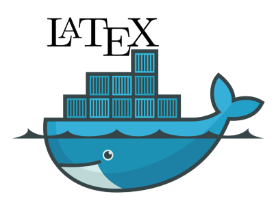

# docker-alpine-texlive

> Minimal TeX Live installation Docker image

The purpose of this image is to have a TeX Live installation with the bare
minimum needed to produce Computer Science reports.

Depends on [SatoshiPortal's](https://github.com/SatoshiPortal/alpine-pkg-glibc)
glibc apk builds for alpine linux. Thanks Satoshi!

## Setup

1. [Install Docker](https://www.docker.com/get-docker)
2. Add your user to the Docker group (this is to avoid using `sudo` each time
   you need to run a command):

```
sudo groupadd docker
sudo usermod -aG docker $USER
```

Log out and log back in so that your group membership is re-evaluated.

3. Download the image:

```
docker pull ivanpondal/alpine-latex
```

## Run

1. Change your working directory to the latex project root.
2. Run `pdflatex` on your main file:

```
docker run --rm -v $PWD:/workdir:z ivanpondal/alpine-latex pdflatex <TEX_FILE>
```

## Adding new packages

### Sample project

To see an example of how this image can be used and extended you can visit
[docker-alpine-texlive-sample](https://github.com/ivanpondal/docker-alpine-texlive-sample).

### Extending the image

If you wish to add your own selection of packages to this image you may extend
it by writing a new `Dockerfile` as follows:

```
FROM ivanpondal/alpine-latex:2.0.1

RUN apk --no-cache add perl wget && \
	tlmgr install <NEW_PACKAGES> && \
	apk del perl wget
```

We need to install `perl` and `wget` because they're dependencies for `tlmgr`.
By installing and removing them in the same `RUN` instruction we avoid adding
them to the final layer.

Build the image:

```
docker buildx build --platform linux/arm64,linux/amd64 -t <IMAGE_NAME> --progress=plain .
```

### Modifying the image

Alternatively, you may modify the original `Dockerfile` by altering the additional
packages `RUN` instruction:

```
# Install additional packages
RUN apk --no-cache add perl wget && \
	tlmgr install <NEW_PACKAGES> bytefield algorithms algorithm2e ec fontawesome && \
	apk del perl wget && \
	mkdir /workdir
```

Build the image:

```
docker build . -t <NEW_IMAGE_NAME>
```
